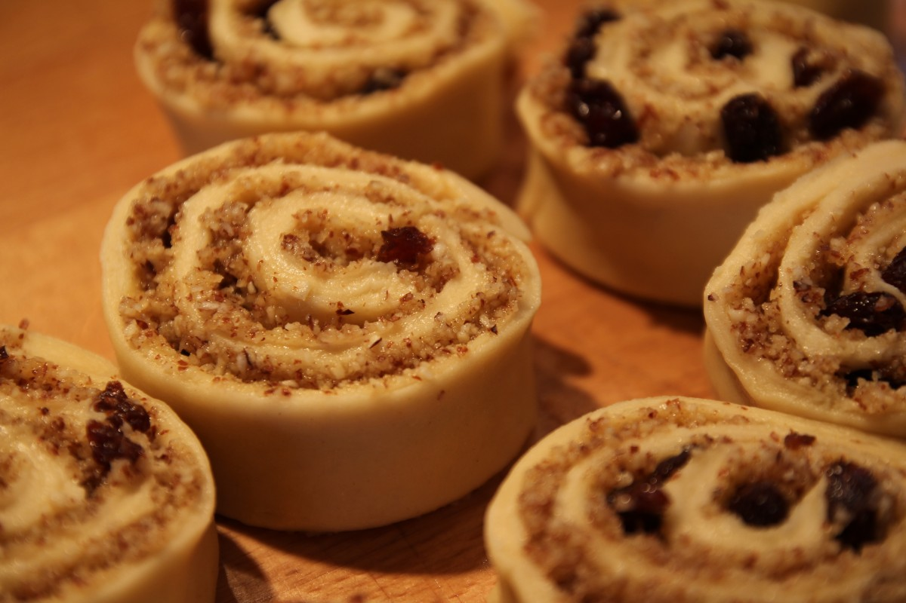
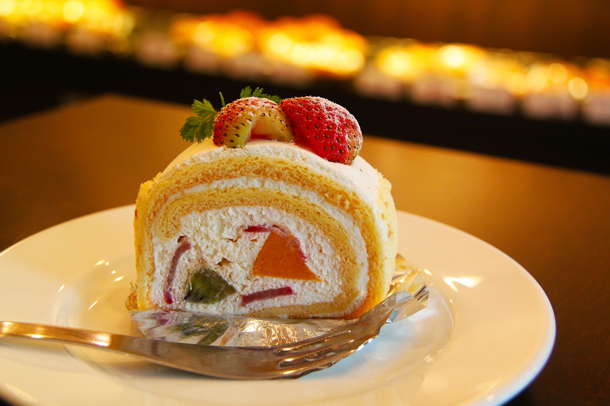

# SSUI Homework 4

By Jia Zheng (jzheng2@andrew.cmu.edu)

**Notes**

Please use Chrome/Firefox as Edge does not support certain features used.

Link to website [here](https://jzheng13.github.io/SSUI-Homework-4/).

Formatted write-up [here]().

## Reflections

A. *What​ ​things​ ​do​ ​you​ ​like​ ​about​ ​React’s​ ​syntax?​ ​What​ ​makes​ ​React​ ​easier​ ​to​ ​deal with​ ​than​ ​vanilla​ ​Javascript?** 

   React is component-based. This means that instead of writing the same lines of HTML code for similar elements, we can do refactoring by programmatically constructing the elements in React and render them. This also means that when we want to change the view of a single component, we do not have to change the code in several HTML pages but just the rendering function.

B. *What​ ​makes​ ​React​ ​harder​ ​to​ ​use?​ ​What​ ​features​ ​of​ ​React​ ​still​ ​confuse​ ​you?*

   React is somewhat difficult to use since it has no fixed organisation and structure. This flexibility means that planning for web applications is harder, as it is difficult to envision what sort of organisation is best suitable, and changing the structure of the application is a hassle towards the latter stages of development.

C. *What​ ​did​ ​you​ ​learn​ ​from​ ​this​ ​assignment?​ ​What​ ​was​ ​challenging?*

   I learnt how to use the React JavaScript library. The challenging part was porting an already "functional" web application to a React project. 

## Bonus Feature

It was suggested that we put​ ​all​ ​product​ ​data​ ​in​ ​a​ ​JSON​ ​file​ and ​dynamically​ ​load information​ ​on​ ​our​ ​page​ ​to display​ ​products. This was implemented in our new build of Bun Bun Bake Shop's webpage. 

Another bonus feature implemented was the grouping of orders for the same flavour (cart will only update for different flavour). 

## Resources Used

1. Images (labelled reuse with modifications)

   
   Retrieved from Wikipedia https://upload.wikimedia.org/wikipedia/commons/3/3b/Cinnamon_rolls_from_above%2C_April_2009.jpg on 28 September 2017

   
   Retrieved from Wikipedia https://commons.wikimedia.org/wiki/File:Johns_Inc_Cinnamon_Rolls.jpg on 28 September 2017

   
   Retrieved from Pixabay https://cdn.pixabay.com/photo/2016/12/09/14/40/cinnamon-1894991_1280.jpg on 28 September 2017

   
   Retrieved from Pixabay https://cdn.pixabay.com/photo/2016/07/02/02/26/buns-1492328_1280.jpg on 28 September 2017

   
   Retrieved from pxhere https://pxhere.com/en/photo/1084511

   
   Retrieved from pixabay https://pixabay.com/en/food-pizza-roll-baked-712667/

   
   Retrieved from Wikipedia https://upload.wikimedia.org/wikipedia/commons/3/32/Vegan-cinnamon-rolls_%2811514387276%29.jpg

   
   Retrieved from Flicker https://c2.staticflickr.com/4/3949/15085119054_f4a6f695f2_b.jpg

   
   Retrieved from Wikipedia https://upload.wikimedia.org/wikipedia/commons/9/96/Cinnamon_rolls_for_breakfast%2C_December_2007.jpg

   
   Retrieved from pxhere https://pxhere.com/en/photo/878968

   
   Retrieved from Wikipedia https://upload.wikimedia.org/wikipedia/commons/e/e6/Vegan_Pumpkin_Cinnamon_rolls_%285159613455%29.jpg

   
   Retrieved from Wikipedia https://upload.wikimedia.org/wikipedia/commons/d/d6/Caramel_pecan_sticky_buns_on_wire_rack.jpg

   
   Retrieved from Wikipedia https://upload.wikimedia.org/wikipedia/commons/8/87/Cinnamon_roll_buns_fresh_from_the_oven%2C_March_2010.jpg

   
   Retrieved from Wikipedia https://pxhere.com/en/photo/34989

   
   Retrieved from Wikipedia https://upload.wikimedia.org/wikipedia/commons/thumb/a/a0/Cinnamon_rolls_in_baking_tray%2C_April_2009.jpg/640px-Cinnamon_rolls_in_baking_tray%2C_April_2009.jpg

   
   Retrieved from pixabay https://pixabay.com/en/cake-cream-strawberry-dessert-219595/

   
   Retrieved from pixabay https://pixabay.com/en/bake-baked-bakery-biscuit-cake-1841145/

   
   Retrieved from pixabay https://pixabay.com/en/cinnamon-rolls-pastry-homemade-1079584/

   
   Retrieved from Wikipedia https://upload.wikimedia.org/wikipedia/commons/2/25/Saturday_night_fever_-_cinnamon_buns.jpg
   
2. Font Awesome (by Dave Gandy) icon pack

   Retrieved from http://fontawesome.io/

3. React JavaScript library

   https://reactjs.org/

